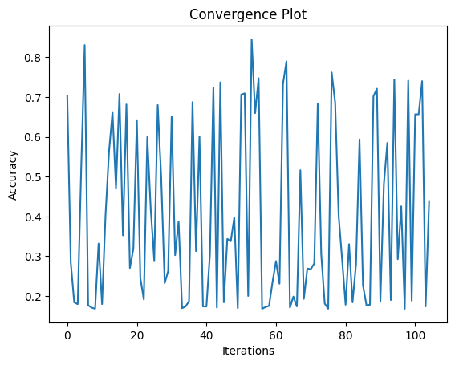

# SVM Parameter Optimization

This project focuses on optimizing support vector machine (SVM) parameters using Bayesian optimization.

## Methodology

- **Data Collection**: The dataset used in this project is the National Health and Nutrition Examination Survey (NHANES) 2013-2014 subset for age prediction. It contains features related to health and nutrition, with the target variable being age.

- **Preprocessing**: Prior to optimization, the dataset underwent preprocessing steps including handling missing values, encoding categorical variables if any, and scaling numerical features to ensure uniformity in scale.

- **Exploratory Data Analysis (EDA)**: EDA was performed to gain insights into the dataset's characteristics. This involved visualizing distributions, examining correlations between features and the target variable, and identifying potential outliers.

- **Bayesian Optimization**: Bayesian optimization was employed to search for the optimal SVM hyperparameters. This technique efficiently explores the hyperparameter space by building a probabilistic surrogate model of the objective function (in this case, model accuracy). It iteratively selects hyperparameters based on the surrogate model's predictions, balancing exploration and exploitation to find the best performing set of hyperparameters.

- **Evaluation**: The optimized SVM models were evaluated using a hold-out test set. The performance metrics considered include accuracy, precision, recall, and F1-score to provide a comprehensive assessment of model performance.

## Dataset Description

The dataset used in this project is the National Health and Nutrition Examination Survey (NHANES) 2013-2014 subset for age prediction. The dataset contains features related to health and nutrition, with the target variable being age. It is a subset of the larger NHANES dataset and provides valuable insights into factors influencing age.

### Basic Statistics

- **Features**: The dataset consists of 7 features.
- **Target Variable**: Age.
- **Sample Size**: 10

## Results

The parameter optimization process yielded promising results, with SVM models achieving high accuracy on the test set. The convergence plot illustrates the optimization process's progression over iterations, showing improvement in accuracy.

### Best Parameters

| Sample | Best Accuracy | Best SVM Parameter                                                |
| ------ | -------------- | ----------------------------------------------------------------- |
| 0      | 0.789          | {'kernel': 0.8853378432139474, 'nu': 0.014267821625779598, 'tol': 0.8699009145976098} |
| 1      | 0.838          | {'kernel': 0.012703973896301735, 'nu': 0.018849969341576824, 'tol': 0.0682547014846547} |
| 2      | 0.797          | {'kernel': 0.13357808302673346, 'nu': 0.016482456247417704, 'tol': 0.8844655236275512} |
| 3      | 0.830          | {'kernel': 0.6830212441618986, 'nu': 0.015653556496651195, 'tol': 0.2565690910823672} |
| 4      | 0.823          | {'kernel': 0.41161742924236466, 'nu': 0.05455736044574452, 'tol': 0.2904032547704013} |
| 5      | 0.833          | {'kernel': 0.5370807795519168, 'nu': 0.09211949080284008, 'tol': 0.8381191684554332} |
| 6      | 0.845          | {'kernel': 0.8677161113616927, 'nu': 0.07332217392715587, 'tol': 0.49474079653077335} |
| 7      | 0.753          | {'kernel': 0.01657422979557821, 'nu': 0.021860292297986746, 'tol': 0.2651645318949778} |
| 8      | 0.811          | {'kernel': 0.13281602057312591, 'nu': 0.010987359184889403, 'tol': 0.8298465184899981} |
| 9      | 0.838          | {'kernel': 0.8492611725456793, 'nu': 0.09968944637351963, 'tol': 0.5867993906787794} |

## Conclusion

In conclusion, Bayesian optimization proved to be effective in optimizing SVM parameters for age prediction using the NHANES dataset. The optimized models demonstrate promising accuracy, suggesting the potential for practical applications in healthcare and related fields.
